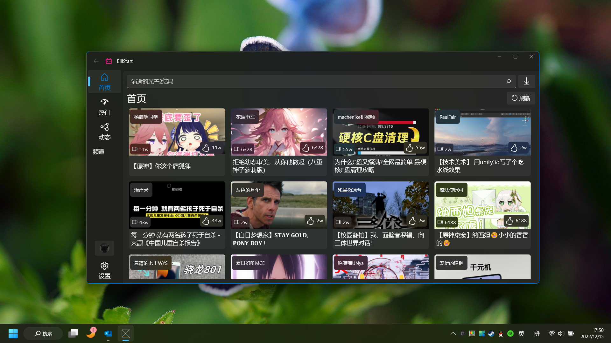
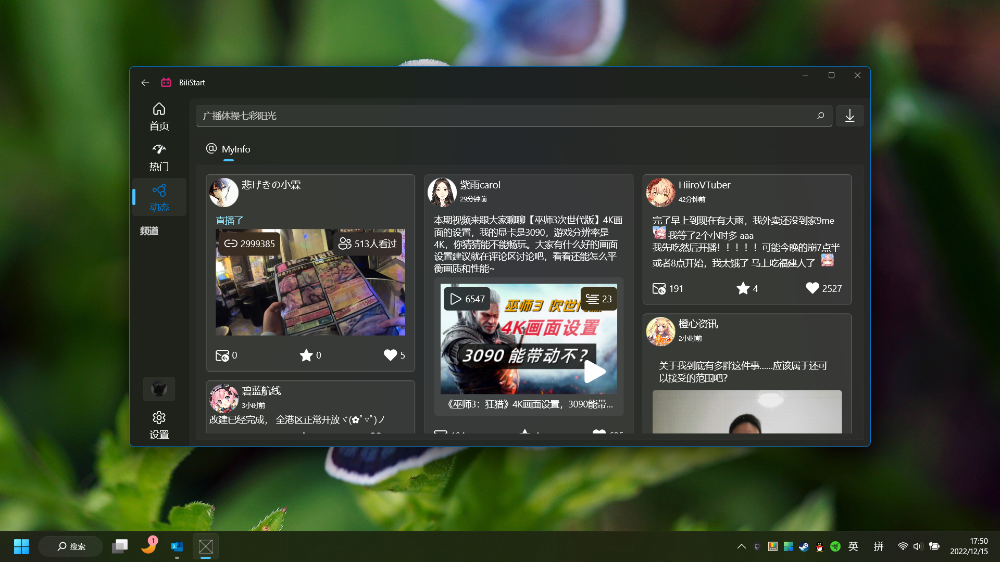
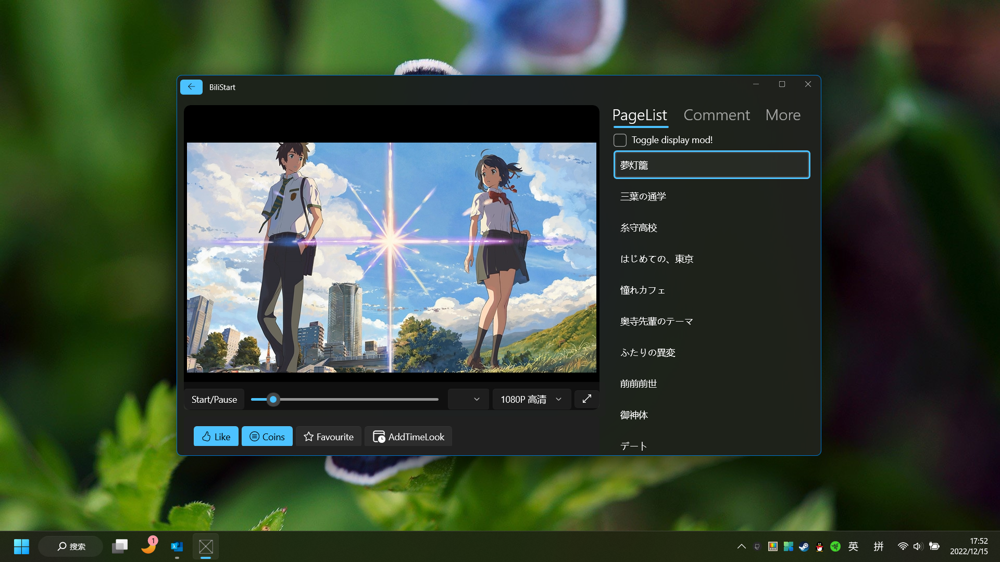

# BiliStart
 
**WindowAppSDK的Bilibili客户端**
 
如果您看到了这个项目，可以尝试clone下来，帮助我一起开发，又或者给一个Star？
 
需要的环境如下：
 
*开发者：熟悉C#，熟悉MVVM，熟悉XAML*
 
*环境：Win11（可选）、Visual Studio 2022*

如果您熟悉以上技术，但且不会WinUI3，请不要担心，可以点击[这里](https://learn.microsoft.com/zh-cn/windows/apps/winui/winui3/)查看官方的文档。

感谢WinUIEx
 
感谢WindowsAppSDK
 
Template Studio for WinUI

该项目的API在[这里](https://github.com/BlameTwo/BiliBiliAccount.git/)，在clone本项目的同时请引用该api项目，并修改BiliStart的项目文件应用其API项目即可。

预览：

 

 

 
计划：

- [x] 扫码登陆

- [x] ~~账号密码登录~~
- [x] 短信验证码登录

- [x] 首页

- [x] 热门

- [x] 排行榜

- [x] 分区排行

- [x] 全区音乐榜单

- [x] 每周必看

- [x] 入站必刷

- [x] 搜索（搜索建议、视频搜索，番剧搜索，电影、纪录片、电视剧、综艺）

- [ ] 动态（残

- [ ] 个人中心

- [ ] 消息中心

- [ ] 我的收藏

- [ ] 稍后再看

- [ ] 账号管理（计划增加多账号）
  
  以上ToDO为当前进度，会随着时间而增加。
🙌很大的BUG
